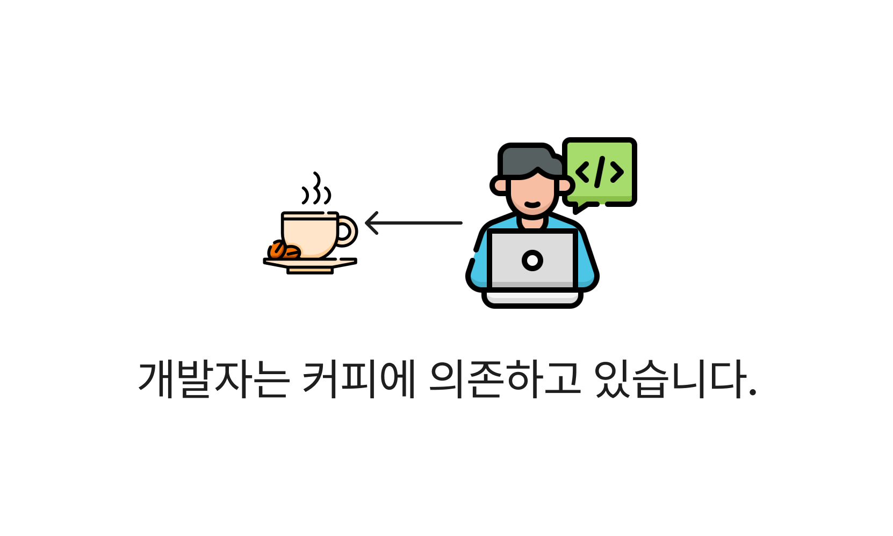
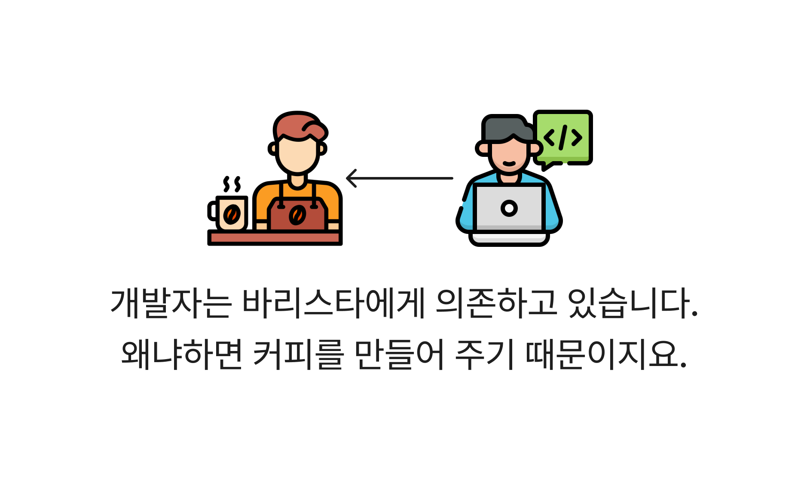
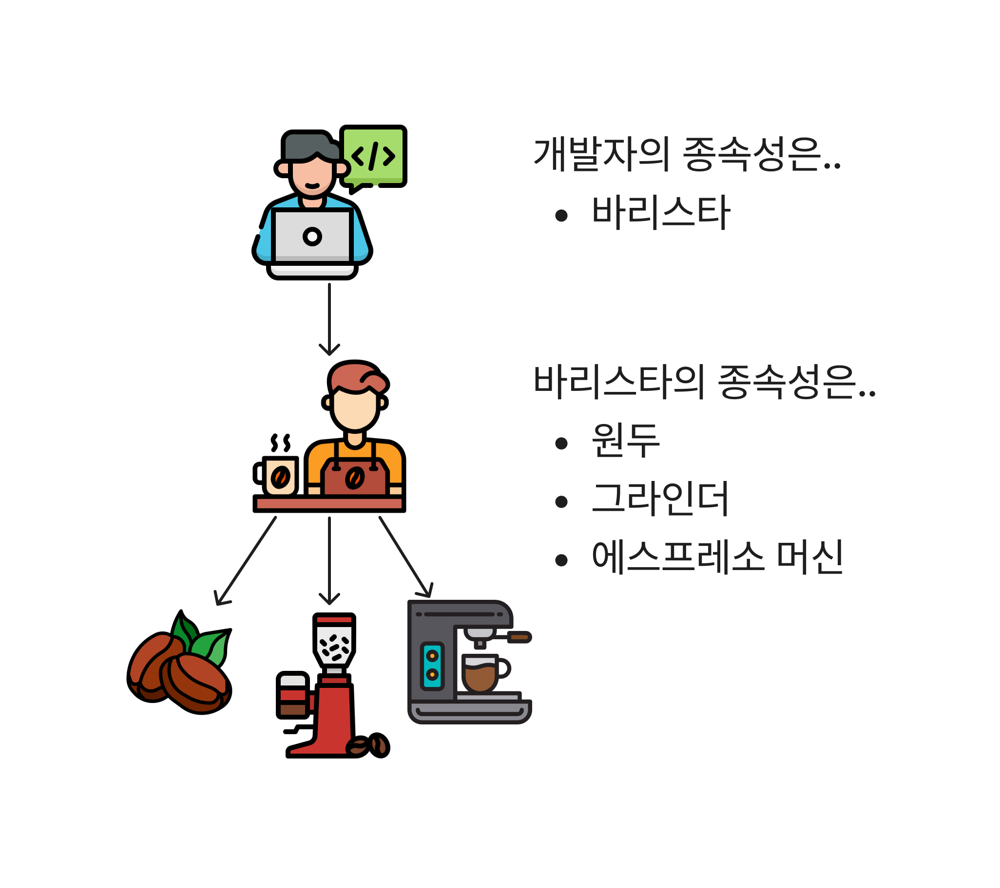

# 종속성 주입을 통한 관리

DI(Dependency Injection) 이라고 불리는 종속성 관리 기법은 여러 프레임워크에서 사용하는 디자인 패턴입니다. 지금까지 프레임워크에서 시키는대로 사용했었죠. 다음과 같이 말이죠!

```typescript
// NestJS 모듈 데코레이터에 관리할 종속성을 입력합니다.
@Module({
  providers: [Barista, Bean],
  controllers: [Developer],
})
class DeveloperModule {}
```

NestJS를 예로 들어보겠습니다. `@Module()` 데코레이터에서 종속성 클래스(또는 객체)를 정의하면 모듈 내에서 자유롭게 사용할 수 있습니다. 여기서 providers에 정의된 `Barista`는 `Bean`을 종속하고 있습니다.

```typescript
@Injectable()
class Barista {
  constructor(private bean: Bean) {}
}
```

`Barista`는 `Bean`에 의존하고 있습니다. 즉, `Bean`에게 무슨 일이 발생하면 우리의 `Barista`가 매우 당황할 거에요. 왜냐면 `Barista`가 `Bean`을 이용하여 어떠한 일을 수행하고 있기 때문입니다.

```typescript
class Barista {
  ...
  // 커피를 추출합니다.
  brew(beanName: string) {
    const wholeBean = this.bean.from({ g: 20 });
    const groundCoffee = this.grinder.execute(wholeBean);
    const coffee = this.espressoMachine.execute(groundCoffee);
    return coffee;
  }
}
```

`Barista`는 커피를 추출하기 위해 `Bean` 인스턴스에서 `this.bean.from({ g: 20 });` 코드를 사용하고 있습니다.

만약, `Bean` 클래스의 사양이 변경된다면 어떻게 될까요? 이렇게 말이죠.

```typescript
class Bean {
  constructor(beanName: string) {
    ...
  }
}

class Barista {
  constructor(
    // Error: Bean 클래스에서 파라미터를 받고 있습니다!
    private bean: Bean
  ) {}
}
```

`beanName` 파라미터를 추가하여 커피의 종류에 따라 추출할 수 있도록 해봤습니다. 자, 여기서 문제점이 생겼네요! 우리 `Barista` 클래스에서는 `Bean` 클래스를 종속하고 있기 때문에 `Barista` 클래스는 매우 당황하고 있네요.

하지만 너무 걱정할 필요 없습니다. 왜나면 NestJS에서 종속성을 알아서 잘 관리해주기 때문이지요. 아래처럼요!

```typescript
const beanProvider = {
  provide: 'BEAN',
  useValue: new Bean('kenya'),
};

@Module({
  providers: [Barista, beanProvider],
  constrollers: [DeveloperController],
})
```

이렇게 NestJS에서는 모듈에서 여러 종속성을 해줍니다. 이를 IoC 컨테이너라고 부르는데 천천히 알아가 보도록할게요😉

---

### 종속성이란?

종속성(Dependency)이란 단어 자체가 어려워 보이지만 그렇게 어려운 뜻은 아닙니다. 객체지향 패러다임에서는 객체와 객체간의 '상호협력'을 통해 여러 기능을 수행하는데요. 이러한 상호협력을 위해서는 한 객체가 다른 객체의 도움을 주고 받는 '의존관계'가 형성됩니다.

문장으로 해석하려니 조금 어렵네요. 그림을 통해 이해해봅시다!



예제에서 개발자는 커피를 필요로 하고있습니다. 이런 커피에 의존하고 있군요! 하지만, 커피를 만드는 건 바리스타이기 때문에 다음과 같이 정정할 필요가 있겠네요.



개발자는 바리스타에게 의존하고 있습니다. **즉, 개발자의 종속성은 바리스타가 되는 것이지요.**



정리하자면, 종속성이란 한 객체가 다른 객체를 의존할 경우를 말합니다. 이를 통해 특정 객체를 사용하는 클래스가 해당 객체의 구체적인 구현에 의존하게 됩니다.

---

### 종속성 관리가 필요한 이유

종속성 관리가 필요한 이유에 대해서 설명하기 위해 프레임워크에 도움없이 직접 구현해보겠습니다!

예제에 이어서 필요한 객체는 다음과 같습니다.

```typescript
// 개발자
class Developer {
  private barista: Barista // 개발자의 종속성
}
// 바리스타
class Barista {
  brewingEsspresso(): Esspresso;
}
// 원두커피
class Bean {
  from(): Bean;
}
```

여기서 재밌는 상황을 하나 만들어 보겠습니다. 커피를 추출하는게 바리스타만이 아닌, 개발자도 만들 수 있게 해보면 어떨까요?

기능적 요구사항은 다음과 같습니다.

 - *바리스타는 커피를 만들 수 있습니다.*
 - ***개발자도 커피를 만들 수 있습니다!***

이제는 개발자도 커피를 만들 수 있게 되었습니다. 대신 커피메이커를 통해서만 만들 수 있습니다. 개발자가 에스프레소까지 추출할 필요는 없으니깐요.(우리 바리스타 친구가 도와줄겁니다😉)

```typescript
class Developer {
  ...

  // 이제는 커피도 직접 추출합니다. 물론, 커피메이커를 통해서요!
  brew() {
    const bean = new Bean();
    const coffeeMaker = new CoffeeMaker();
    const coffee = coffeeMaker.execute(bean);
    return coffee;
  }
}
```

#### 종속성 생성 vs 관리

위에서 언급한 개발자의 종속성에 대해 기억하시나요? 바리스타를 의존하기 때문에 바리스타가 종속성이라고 할 수 있겠습니다. 하지만 새로운 요구사항인 "개발자도 커피를 추출할 수 있습니다."를 만족하기 위해 새로운 종속성을 추가할 필요가 있습니다. 바로 `Bean` 객체인데요. 커피를 추출하는 메서드인 `brew()`에서는 직접 `Bean` 객체를 생성하고 있습니다.

우리 바리스타 친구는 어떻게 커피를 추출하고 있을까요? 커피 추출 메서드는 다음과 같이 구현하고 있습니다!

```typescript
class Barista {
  brewingEsspresso() {
    const bean = new Bean();
    const grinder = new Grinder();
    const wholeBean = grinder.execute(bean);
    const esspressoMachine = new EsspressoMachine();
    const esspresso = esspressoMachine.execute(wholeBean);
    return esspressol;
  }
}
```

이런 바리스타 친구는 개발자보다 훨씬 바쁘네요.. 하지만 결국 바리스타 친구도 `Bean` 객체를 생성하고 있습니다.