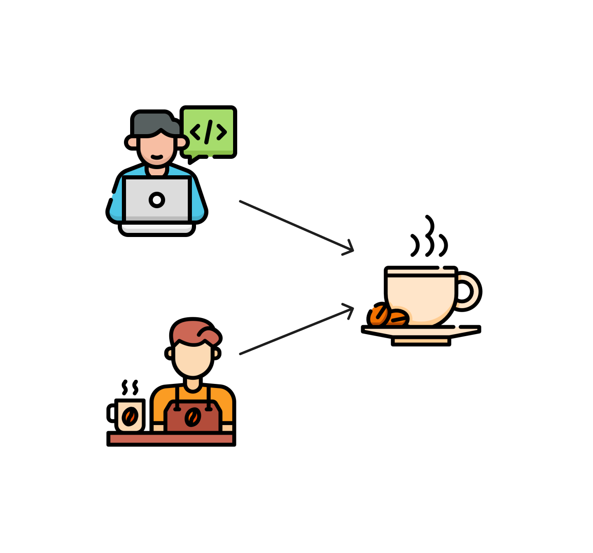
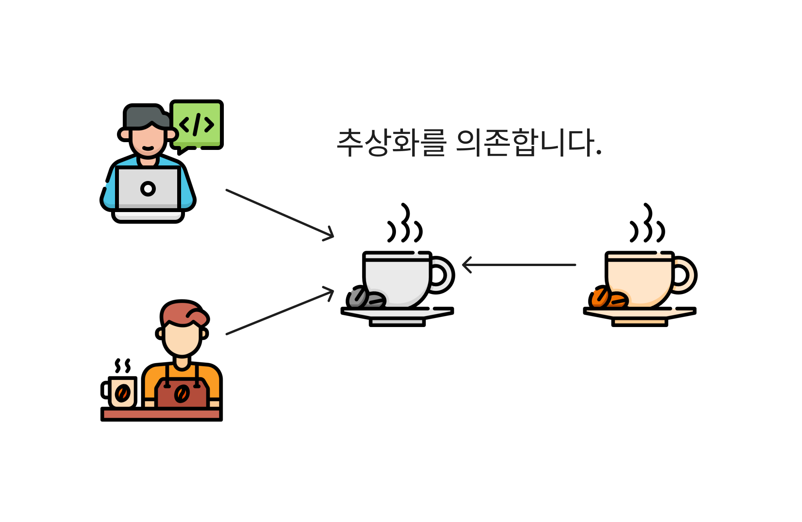

# 종속성 주입을 통한 관리

DI(Dependency Injection) 이라고 불리는 종속성 관리 기법은 여러 프레임워크에서 사용하는 디자인 패턴입니다. 지금까지 프레임워크에서 시키는대로 사용했었죠. 다음과 같이 말이죠!

```typescript
// NestJS 모듈 데코레이터에 관리할 종속성을 입력합니다.
@Module({
  providers: [Barista, Bean],
  controllers: [Developer],
})
class DeveloperModule {}
```

NestJS를 예로 들어보겠습니다. `@Module()` 데코레이터에서 종속성 클래스(또는 객체)를 정의하면 모듈 내에서 자유롭게 사용할 수 있습니다. 여기서 providers에 정의된 `Barista`는 `Bean`을 종속하고 있습니다.

```typescript
@Injectable()
class Barista {
  constructor(private bean: Bean) {}
}
```

`Barista`는 `Bean`에 의존하고 있습니다. 즉, `Bean`에게 무슨 일이 발생하면 우리의 `Barista`가 매우 당황할 거에요. 왜냐면 `Barista`가 `Bean`을 이용하여 어떠한 일을 수행하고 있기 때문입니다.

```typescript
class Barista {
  ...
  // 커피를 추출합니다.
  brew(beanName: string) {
    const wholeBean = this.bean.from();
    const groundCoffee = this.grinder.execute(wholeBean);
    const coffee = this.espressoMachine.execute(groundCoffee);
    return coffee;
  }
}
```

`Barista`는 커피를 추출하기 위해 `Bean` 인스턴스에서 `this.bean.from();` 코드를 사용하고 있습니다.

만약, `Bean` 클래스의 사양이 변경된다면 어떻게 될까요? 이렇게 말이죠.

```typescript
class Bean {
  constructor(beanName: string) {
    ...
  }
}

class Barista {
  constructor(
    // Error: Bean 클래스에서 파라미터를 받고 있습니다!
    private bean: Bean
  ) {}
}
```

`beanName` 파라미터를 추가하여 커피의 종류에 따라 추출할 수 있도록 해봤습니다. 자, 여기서 문제점이 생겼네요! 우리 `Barista` 클래스에서는 `Bean` 클래스를 종속하고 있기 때문에 `Barista` 클래스는 매우 당황하고 있네요.

하지만 너무 걱정할 필요 없습니다. 왜나면 NestJS에서 종속성을 알아서 잘 관리해주기 때문이지요. 아래처럼요!

```typescript
const beanProvider = {
  provide: 'BEAN',
  useValue: new Bean('kenya'),
};

@Module({
  providers: [Barista, beanProvider],
  constrollers: [DeveloperController],
})
```

이렇게 NestJS에서는 모듈에서 여러 종속성을 해줍니다. 이를 IoC 컨테이너라고 부르는데 천천히 알아가 보도록할게요😉

---

### 종속성이란?

종속성(Dependency)이란 단어 자체가 어려워 보이지만 그렇게 어려운 뜻은 아닙니다. 객체지향 패러다임에서는 객체와 객체간의 '상호협력'을 통해 여러 기능을 수행하는데요. 이러한 상호협력을 위해서는 한 객체가 다른 객체의 도움을 주고 받는 '의존관계'가 형성됩니다.

문장으로 해석하려니 조금 어렵네요. 그림을 통해 이해해봅시다!


예제에서 개발자는 커피를 필요로 하고있습니다. 이런 커피에 의존하고 있군요! 하지만, 커피를 만드는 건 바리스타이기 때문에 다음과 같이 정정할 필요가 있겠네요.


개발자는 바리스타에게 의존하고 있습니다. **즉, 개발자의 종속성은 바리스타가 되는 것이지요.**


정리하자면, 종속성이란 한 객체가 다른 객체를 의존할 경우를 말합니다. 이를 통해 특정 객체를 사용하는 클래스가 해당 객체의 구체적인 구현에 의존하게 됩니다.

---

### 종속성 관리가 필요한 이유

종속성 관리가 필요한 이유에 대해서 설명하기 위해 프레임워크에 도움없이 직접 구현해보겠습니다!

예제에 이어서 필요한 객체는 다음과 같습니다.

```typescript
// 개발자
class Developer {
  private barista: Barista; // 개발자의 종속성
}
// 바리스타
class Barista {
  brewingEsspresso(): Esspresso;
}
// 원두커피
class Bean {
  from(): Bean;
}
```

여기서 재밌는 상황을 하나 만들어 보겠습니다. 커피를 추출하는게 바리스타만이 아닌, 개발자도 만들 수 있게 해보면 어떨까요?

기능적 요구사항은 다음과 같습니다.

- _바리스타는 커피를 만들 수 있습니다._
- **_개발자도 커피를 만들 수 있습니다!_**

이제는 개발자도 커피를 만들 수 있게 되었습니다. 대신 커피메이커를 통해서만 만들 수 있습니다. 개발자가 에스프레소까지 추출할 필요는 없으니깐요.(우리 바리스타 친구가 도와줄겁니다😉)

```typescript
class Developer {
  ...

  // 이제는 커피도 직접 추출합니다. 물론, 커피메이커를 통해서요!
  brew() {
    const bean = new Bean();
    const coffeeMaker = new CoffeeMaker();
    const coffee = coffeeMaker.execute(bean.from());
    return coffee;
  }
}
```

### 종속성 생성의 문제점

위에서 언급한 종속성에 대해 기억하시나요? 개발자는 바리스타를 의존하기 때문에 바리스타 객체가 종속성이라고 할 수 있겠습니다. 하지만 새로운 요구사항인 "개발자도 커피를 추출할 수 있습니다."를 만족하기 위해 새로운 종속성을 추가할 필요가 있습니다. 바로 `Bean` 객체인데요. 커피를 추출하는 메서드인 `brew()`에서는 직접 `Bean` 객체를 생성하고 있습니다.

우리 바리스타 친구는 어떻게 커피를 추출하고 있을까요? 커피 추출은 다음과 같이 구현하고 있습니다!

```typescript
class Barista {
  brewingEsspresso() {
    const bean = new Bean();
    const grinder = new Grinder();
    const wholeBean = grinder.execute(bean.from());
    const esspressoMachine = new EsspressoMachine();
    const esspresso = esspressoMachine.execute(wholeBean);
    return esspressol;
  }
}
```

이런 바리스타 친구는 개발자보다 훨씬 바쁘네요.. 하지만 결국 바리스타도 `Bean` 객체를 생성하고 있습니다.

```typescript
const bean = new Bean();
```

이렇게 종속성을 추가하는 방식은 몇 가지 문제가 있습니다. 대표적으로 종속성의 사양이 변경될 때 인데요. 도입부에서 `Bean` 객체의 생성자에 새로운 파라미터를 추가했을 때 어떻게 되었는지 기억하시나요? 바로 모듈에서 제공하던 Provider에 파라미터만 추가했었습니다. 아래 코드를 잠깐 보실까요.

```typescript
class Bean {
  // constructor() { ... }
  constructor(beanName: string) { ... } // 'beanName' 파라미터가 추가 되었습니다.
}

const beanProvider = {
  provide: 'BEAN_PROVIDER',
  useValue: new Bean('kenya'),
};
```

이렇게 한다면 NestJS에서 알아서 인스턴스들을 관리해줍니다. 하지만, 프레임워크의 도움 없이는 어떻게 될까요? 아마도 객체를 생성한 모든 코드들을 하나하나 찾아가 파라미터를 추가해줘야 겠지요.

```typescript
class Developer {
  brew() {
    const bean = new Bean(); // Error: 생성자 파라미터를 입력해주세요.
  }
}
class Barista {
  brewingEsspresso() {
    const bean = new Bean(); // Error: 생성자 파라미터를 입력해주세요.
  }
}
```

우리의 개발자와 바리스타 친구가 굉장히 곤란해하고 있습니다. 종속성인 `Bean` 클래스에 사양이 변경되어 각각의 객체에서 관리가 이루어져야 하기 때문에 인데요. 규모가 큰 프로젝트에서는 꽤나 심각한 문제입니다.

그렇다면 이러한 확장성이 떨어지는 문제를 어떻게 해결해야 할까요?

### 종속성 주입하기

종속성 생성으로 인한 문제를 해결하는 방법은 간단합니다. 외부에서 종속성 객체를 제공하는 것인데요. 이를 이번 글에 주제인 **종속성 주입(DI, Dependency Injection)** 이라고 합니다.

종속성 주입이 어떻게 위와 같은 문제를 해결하는지 예제를 통해 알아볼게요.
우선 우리의 개발자와 바리스타 친구는 `Bean` 객체를 직접 생성하여 커피 추출이라는 메서드를 구현하고 있습니다. 이러한 방식의 문제점은 `Bean` 클래스의 사양이 변경됨에 따라, 종속성을 다루고 있는 객체들도 변경에 민감하게 반응하여 확장성이 떨어지는 문제였었지요.

그렇다면 종속성을 직접 생성하지 않고 주입 받는다면 어떨까요? 예제 코드를 보시죠.

```typescript
class Developer {
  constructor(private bean: Bean) {}

  brew() {
    // const bean = new Bean(); <-- Error
    const bean = this.bean; // <-- 주입받은 종속성을 사용합니다.
  }
}

class Barista {
  constructor(private bean: Bean) {}

  brewingEsspresso() {
    // const bean = new Bean(); <-- Error
    const bean = this.bean; // <-- 주입받은 종속성을 사용합니다.
  }
}

class Bean {
  constructor(beanName: string) {}
}

// 앱을 실행하는 함수입니다.
function main() {
  const bean = new Bean(); // Error!
  const developer = new Developer(bean); // <-- 종속성 주입
  const barista = new Barista(bean); // <-- 종속성 주입
  ...
}
```

`main()` 함수를 보시면 개발자와 바리스타의 종속성을 주입하고, 각각의 객체가 주입받은 종속성을 사용하고 있습니다. `main()` 함수는 `Bean` 클래스의 생성자가 변경됨에 따라 에러가 발생했지만, 덕분에 개발자와 바리스타 친구가 문제에서 벗어날 수 있었습니다.

이렇게 종속성 주입을 통해서 '종속성을 관리'라는 기능을 분리하여 단일 책임 원칙(SRP)을 달성할 수 있습니다.

하지만, 종속성 주입을 달성하기 위해서는 아직 부족합니다. 왜냐하면 객체를 주입하고 있지만 아직 종속성의 변경에 민감하기 때문인데요. 다음과 같이 말이죠.

```typescript
class Bean {
  constructor(beanName: string) {}

  // 원두의 양(g)을 파라미터로 받습니다.
  from(g: number) { ... }
}

class Developer {
  constructor(private bean: Bean) {}

  brew() {
    const bean = this.bean.from(); // Error! 파라미터를 입력해주세요.
    ...
  }
}
class Barista {
  constructor(private bean: Bean) {}

  brewingEsspresso() {
    const bean = this.bean.from(); // Error! 파라미터를 입력해주세요.
  }
}
```

`bean.from()` 메서드를 사용하고 있는 커피 추출 메서드에서 문제가 발생하고 있습니다! 이러한 문제를 해결하기 위해 한 가지 조치를 더 취하려고 합니다.




### 추상화하기

종속성 주입의 마지막 관문은 종속성의 추상화입니다. 추상화된 객체를 의존함으로써 유연성을 가져갈 수 있는 것이지요. 쉽게 말해 주입 받을 종속성에 사양을 정하여 주입 받는 것입니다!

```typescript
interface IBean {
  new (beanName: string);
  from(g: number);
}

class BeanImplement implements IBean {
  constructor(beanName: string) {}

  from(g: number) { ... }
}

class Developer {
  constructor(public bean: IBean) {}
}
class Barista {
  constructor(public bean: IBean){}
}
```

기존에는 `Bean` 객체를 직접 주입 받고 있었습니다. 떄문에 `Bean` 객체의 변경에는 아직 민감했었지요. 하지만 추상화된 객체를 의존함으로써 객체 간의 결합도(Coupling)를 낮추고, 유연한 구조로 개선할 수 있습니다. 이를 의존성 역정 원칙(DIP)라고 부릅니다.

